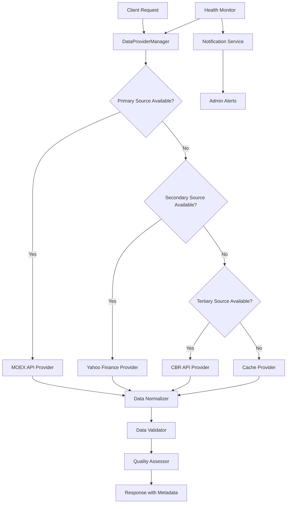

# Design Document

## Overview

API Fallback System - это система резервных источников данных, которая обеспечивает непрерывную работу анализа российских БПИФов даже при недоступности основных API. Система основана на паттерне Chain of Responsibility и интегрируется с существующей архитектурой BaseETFCollector.

Основная цель - повысить надежность системы с текущих 30% (2 из 10 API активны) до 95%+ за счет интеллектуального переключения между источниками данных и использования кэшированных данных.

## Architecture

### High-Level Architecture



### Core Components

#### 1. DataProvider Interface
Унифицированный интерфейс для всех источников данных:

```python
from abc import ABC, abstractmethod
from typing import Dict, List, Optional
from enum import Enum

class DataSourceStatus(Enum):
    ACTIVE = "active"
    DEGRADED = "degraded"
    UNAVAILABLE = "unavailable"
    UNKNOWN = "unknown"

class DataProvider(ABC):
    @abstractmethod
    def get_securities_list(self) -> List[Dict]
    
    @abstractmethod
    def get_market_data(self, ticker: str) -> Dict
    
    @abstractmethod
    def get_historical_data(self, ticker: str, days: int) -> Dict
    
    @abstractmethod
    def get_trading_volume_data(self, ticker: str) -> Dict
    
    @abstractmethod
    def health_check(self) -> DataSourceStatus
    
    @abstractmethod
    def get_source_info(self) -> Dict
```

#### 2. DataProviderManager
Центральный менеджер для управления источниками данных:

```python
class DataProviderManager:
    def __init__(self, config: FallbackConfig):
        self.providers = self._initialize_providers(config)
        self.health_monitor = HealthMonitor(self.providers)
        self.cache_provider = CacheProvider()
        self.data_normalizer = DataNormalizer()
        self.quality_assessor = QualityAssessor()
        
    def get_data_with_fallback(self, method: str, **kwargs) -> FallbackResult:
        # Реализация цепочки fallback
        pass
```

#### 3. Specific Data Providers

##### MOEXDataProvider
```python
class MOEXDataProvider(DataProvider):
    def __init__(self):
        self.base_url = "https://iss.moex.com/iss"
        self.priority = 1  # Highest priority
        self.data_quality = "high"
        
    def health_check(self) -> DataSourceStatus:
        # Проверка доступности MOEX API
        pass
```

##### YahooFinanceProvider
```python
class YahooFinanceProvider(DataProvider):
    def __init__(self):
        self.base_url = "https://query1.finance.yahoo.com/v8/finance"
        self.priority = 2
        self.data_quality = "medium"
        
    def get_market_data(self, ticker: str) -> Dict:
        # Конвертация тикера в Yahoo формат (SBER -> SBER.ME)
        yahoo_ticker = self._convert_ticker(ticker)
        # Получение данных и нормализация
        pass
```

##### CBRDataProvider
```python
class CBRDataProvider(DataProvider):
    def __init__(self):
        self.base_url = "https://www.cbr-xml-daily.ru/api"
        self.priority = 3
        self.data_quality = "high"
        self.data_scope = "macro"  # Только макроэкономические данные
```

##### WebScrapingProvider
```python
class WebScrapingProvider(DataProvider):
    def __init__(self):
        self.sources = [
            "https://smart-lab.ru",
            "https://www.finam.ru",
            "https://www.investing.com"
        ]
        self.priority = 4
        self.data_quality = "low"
```

## Components and Interfaces

### 1. Health Monitoring System

```python
class HealthMonitor:
    def __init__(self, providers: List[DataProvider]):
        self.providers = providers
        self.health_history = {}
        self.check_interval = 300  # 5 minutes
        
    def continuous_monitoring(self):
        # Непрерывный мониторинг состояния источников
        pass
        
    def get_provider_metrics(self, provider_name: str) -> Dict:
        return {
            'status': DataSourceStatus.ACTIVE,
            'response_time_ms': 150,
            'success_rate_24h': 0.98,
            'last_successful_request': datetime.now(),
            'error_count_1h': 2
        }
```

### 2. Data Normalization Layer

```python
class DataNormalizer:
    def normalize_market_data(self, raw_data: Dict, source: str) -> Dict:
        # Приведение данных к единому формату
        normalized = {
            'ticker': self._extract_ticker(raw_data, source),
            'last_price': self._extract_price(raw_data, source),
            'currency': self._extract_currency(raw_data, source),
            'timestamp': self._extract_timestamp(raw_data, source),
            'source': source,
            'data_quality': self._assess_quality(raw_data, source)
        }
        return normalized
```

### 3. Quality Assessment System

```python
class QualityAssessor:
    def assess_data_quality(self, data: Dict, source: str) -> float:
        score = 0.0
        weights = {
            'completeness': 0.4,
            'freshness': 0.3,
            'accuracy': 0.2,
            'consistency': 0.1
        }
        
        # Расчет метрик качества
        completeness = self._calculate_completeness(data)
        freshness = self._calculate_freshness(data)
        accuracy = self._calculate_accuracy(data, source)
        consistency = self._calculate_consistency(data)
        
        score = (completeness * weights['completeness'] + 
                freshness * weights['freshness'] +
                accuracy * weights['accuracy'] +
                consistency * weights['consistency'])
        
        return min(1.0, max(0.0, score))
```

## Data Models

### 1. FallbackResult
```python
@dataclass
class FallbackResult:
    data: Dict
    source: str
    quality_score: float
    is_cached: bool
    cache_age_hours: Optional[float]
    fallback_level: int  # 0 = primary, 1 = secondary, etc.
    warnings: List[str]
    metadata: Dict
```

### 2. FallbackConfig
```python
@dataclass
class FallbackConfig:
    providers: List[Dict]  # Конфигурация провайдеров
    health_check_interval: int = 300
    cache_ttl_hours: int = 24
    max_cache_age_hours: int = 168  # 1 week
    quality_threshold: float = 0.7
    notification_settings: Dict = None
    
    def __post_init__(self):
        if self.notification_settings is None:
            self.notification_settings = {
                'email_alerts': False,
                'telegram_alerts': False,
                'log_level': 'WARNING'
            }
```

### 3. Provider Configuration
```python
FALLBACK_PROVIDERS = [
    {
        'name': 'moex',
        'class': 'MOEXDataProvider',
        'priority': 1,
        'enabled': True,
        'config': {
            'base_url': 'https://iss.moex.com/iss',
            'timeout': 10,
            'retry_attempts': 3
        }
    },
    {
        'name': 'yahoo_finance',
        'class': 'YahooFinanceProvider',
        'priority': 2,
        'enabled': True,
        'config': {
            'base_url': 'https://query1.finance.yahoo.com/v8/finance',
            'timeout': 15,
            'retry_attempts': 2
        }
    },
    {
        'name': 'cbr',
        'class': 'CBRDataProvider',
        'priority': 3,
        'enabled': True,
        'config': {
            'base_url': 'https://www.cbr-xml-daily.ru/api',
            'data_types': ['currency_rates', 'key_rate']
        }
    }
]
```

## Error Handling

### 1. Exception Hierarchy
```python
class FallbackSystemError(Exception):
    """Базовое исключение системы fallback"""
    pass

class AllProvidersUnavailableError(FallbackSystemError):
    """Все провайдеры недоступны"""
    def __init__(self, provider_errors: Dict[str, Exception]):
        self.provider_errors = provider_errors
        super().__init__(f"All providers failed: {provider_errors}")

class DataQualityError(FallbackSystemError):
    """Качество данных ниже порогового значения"""
    pass

class CacheExpiredError(FallbackSystemError):
    """Кэш устарел и нет доступных провайдеров"""
    pass
```

### 2. Error Recovery Strategy
```python
class ErrorRecoveryManager:
    def handle_provider_failure(self, provider: str, error: Exception):
        # Логирование ошибки
        logger.error(f"Provider {provider} failed: {error}")
        
        # Временное отключение провайдера
        self._disable_provider_temporarily(provider)
        
        # Уведомление администратора
        self._notify_admin(provider, error)
        
        # Попытка восстановления
        self._schedule_recovery_check(provider)
```

## Testing Strategy

### 1. Unit Tests
- Тестирование каждого DataProvider отдельно
- Мокирование API ответов
- Тестирование нормализации данных
- Проверка качества данных

### 2. Integration Tests
- Тестирование цепочки fallback
- Проверка переключения между источниками
- Тестирование с реальными API
- Проверка кэширования

### 3. Load Tests
- Нагрузочное тестирование каждого провайдера
- Тестирование при высокой частоте запросов
- Проверка производительности системы мониторинга

### 4. Chaos Engineering
- Симуляция недоступности API
- Тестирование при частичных сбоях
- Проверка восстановления после сбоев

## Integration with Existing System

### 1. Backward Compatibility
Система интегрируется с существующим BaseETFCollector без нарушения текущего API:

```python
class EnhancedETFCollector(BaseETFCollector):
    def __init__(self):
        super().__init__()
        self.fallback_manager = DataProviderManager(fallback_config)
        
    def get_security_market_data(self, ticker: str) -> Dict:
        # Используем fallback систему вместо прямого вызова MOEX
        result = self.fallback_manager.get_data_with_fallback(
            'get_market_data', 
            ticker=ticker
        )
        
        # Добавляем метаданные о источнике
        data = result.data
        data['_source'] = result.source
        data['_quality'] = result.quality_score
        data['_is_cached'] = result.is_cached
        
        return data
```

### 2. Configuration Integration
Расширение существующего config.py:

```python
@dataclass
class FallbackSystemConfig:
    enabled: bool = True
    providers: List[Dict] = None
    health_check_interval: int = 300
    quality_threshold: float = 0.7
    cache_fallback_enabled: bool = True
    max_cache_age_hours: int = 168
    
class Config:
    def __init__(self, base_path: str = None):
        # ... existing code ...
        self.fallback = FallbackSystemConfig()
```

## Performance Considerations

### 1. Caching Strategy
- Многоуровневое кэширование (память + файл)
- Асинхронное обновление кэша
- Интеллигентная инвалидация

### 2. Connection Pooling
- Переиспользование HTTP соединений
- Оптимизация таймаутов
- Управление ресурсами

### 3. Async Operations
- Асинхронные проверки здоровья
- Параллельные запросы к разным источникам
- Неблокирующие операции кэширования

## Security Considerations

### 1. API Key Management
- Безопасное хранение токенов
- Ротация ключей
- Разделение прав доступа

### 2. Rate Limiting
- Соблюдение лимитов API
- Интеллигентное распределение запросов
- Защита от блокировок

### 3. Data Validation
- Валидация входящих данных
- Защита от инъекций
- Санитизация веб-скрапинга

## Monitoring and Alerting

### 1. Metrics Collection
```python
class MetricsCollector:
    def collect_provider_metrics(self):
        return {
            'requests_total': 1000,
            'requests_successful': 950,
            'avg_response_time_ms': 200,
            'cache_hit_rate': 0.75,
            'fallback_activations_24h': 5
        }
```

### 2. Alert Conditions
- Провайдер недоступен > 5 минут
- Качество данных < 70%
- Частота fallback > 10% запросов
- Кэш используется > 24 часов

### 3. Dashboard Integration
- Статус всех провайдеров в реальном времени
- Графики производительности
- История переключений
- Качество данных по источникам