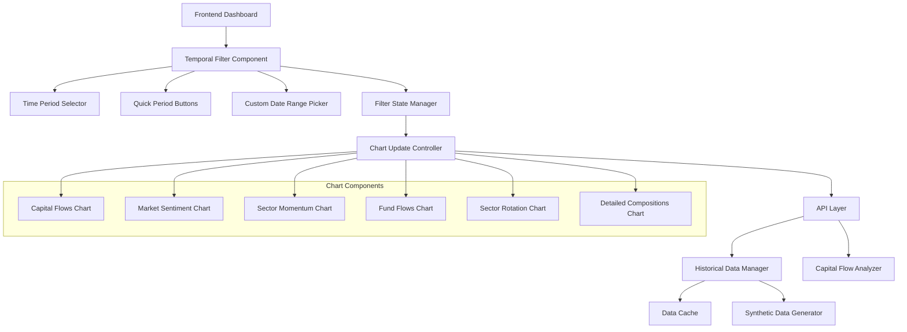
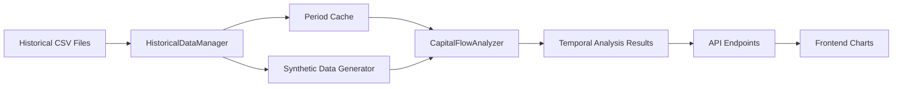

# Design Document

## Overview

Система временных фильтров для дашборда БПИФ предоставляет пользователям возможность анализировать изменения рыночной структуры во времени. Система интегрируется с существующим дашбордом и использует исторические данные для отображения динамики рынка российских биржевых паевых инвестиционных фондов.

## Architecture

### Компонентная архитектура



### Архитектура данных



## Components and Interfaces

### 1. Temporal Filter Component (Frontend)

**Интерфейс:**
```javascript
class TemporalFilter {
    constructor(containerId, options = {})
    
    // Методы управления состоянием
    setTimePeriod(periodIndex)
    getTimePeriod()
    setCustomDateRange(startDate, endDate)
    
    // События
    onPeriodChange(callback)
    onDateRangeChange(callback)
    
    // Обновление UI
    updateAvailablePeriods(periods)
    showLoadingState()
    hideLoadingState()
}
```

**Ответственность:**
- Отображение элементов управления временными фильтрами
- Обработка пользовательского ввода
- Синхронизация состояния между всеми графиками
- Валидация выбранных дат

### 2. Chart Update Controller (Frontend)

**Интерфейс:**
```javascript
class ChartUpdateController {
    constructor(charts = [])
    
    // Управление графиками
    registerChart(chartId, updateFunction)
    updateAllCharts(periodIndex)
    updateChart(chartId, periodIndex)
    
    // Состояние загрузки
    showChartLoading(chartId)
    hideChartLoading(chartId)
    
    // Обработка ошибок
    handleChartError(chartId, error)
}
```

**Ответственность:**
- Координация обновления всех графиков
- Управление состоянием загрузки
- Обработка ошибок при загрузке данных
- Кэширование результатов запросов

### 3. Enhanced Historical Data Manager (Backend)

**Интерфейс:**
```python
class HistoricalDataManager:
    def get_available_periods() -> List[Dict]
    def get_data_for_period(period_index: int) -> pd.DataFrame
    def compare_periods(period1: int, period2: int) -> Dict
    def get_period_metadata(period_index: int) -> Dict
    def validate_period_range(start_date: str, end_date: str) -> bool
```

**Расширения:**
- Поддержка пользовательских диапазонов дат
- Метаданные о доступности данных для каждого периода
- Валидация временных диапазонов
- Оптимизированное кэширование данных

### 4. Temporal API Endpoints (Backend)

**Новые эндпоинты:**
```python
# Получение доступных периодов
GET /api/temporal/periods

# Получение данных для конкретного периода
GET /api/temporal/data/<period_index>

# Сравнение двух периодов
GET /api/temporal/compare/<period1>/<period2>

# Обновленные эндпоинты с поддержкой временных фильтров
GET /api/capital-flows?period=<index>
GET /api/market-sentiment?period=<index>
GET /api/sector-momentum?period=<index>
GET /api/fund-flows?period=<index>
GET /api/sector-rotation?period=<index>
GET /api/detailed-compositions?period=<index>
```

## Data Models

### Period Information Model
```python
@dataclass
class PeriodInfo:
    index: int
    date: datetime
    label: str
    data_available: bool
    data_quality: str  # 'high', 'medium', 'low', 'synthetic'
    fund_count: int
    market_cap_total: float
```

### Temporal Analysis Result Model
```python
@dataclass
class TemporalAnalysisResult:
    period_info: PeriodInfo
    sector_flows: Dict[str, Any]
    sentiment_analysis: Dict[str, Any]
    comparison_data: Optional[Dict[str, Any]]
    metadata: Dict[str, Any]
```

### Filter State Model (Frontend)
```javascript
interface FilterState {
    selectedPeriod: number;
    customDateRange: {
        startDate: string | null;
        endDate: string | null;
    };
    isLoading: boolean;
    availablePeriods: PeriodInfo[];
    syncEnabled: boolean;
}
```

## Error Handling

### Frontend Error Handling

1. **Недоступные данные:**
   - Показать сообщение о недоступности данных
   - Предложить ближайший доступный период
   - Отключить недоступные опции в селекторе

2. **Ошибки загрузки:**
   - Показать индикатор ошибки на графике
   - Предоставить кнопку повторной попытки
   - Логирование ошибок для отладки

3. **Таймауты:**
   - Показать сообщение о задержке после 5 секунд
   - Автоматическая повторная попытка через 10 секунд
   - Возможность отмены запроса

### Backend Error Handling

1. **Отсутствие исторических данных:**
   - Автоматическое создание синтетических данных
   - Четкое указание типа данных (реальные/синтетические)
   - Логирование для мониторинга

2. **Ошибки обработки данных:**
   - Graceful degradation с частичными данными
   - Детальные сообщения об ошибках в логах
   - Fallback на кэшированные данные

## Testing Strategy

### Unit Tests

1. **HistoricalDataManager:**
   - Тестирование загрузки исторических данных
   - Валидация создания синтетических данных
   - Проверка кэширования и производительности

2. **TemporalFilter Component:**
   - Тестирование пользовательских взаимодействий
   - Валидация состояния фильтров
   - Проверка синхронизации между графиками

3. **API Endpoints:**
   - Тестирование всех временных эндпоинтов
   - Проверка обработки ошибок
   - Валидация формата ответов

### Integration Tests

1. **End-to-End Workflow:**
   - Полный цикл выбора периода и обновления графиков
   - Тестирование синхронизации между компонентами
   - Проверка производительности при переключении периодов

2. **Data Consistency:**
   - Проверка согласованности данных между периодами
   - Валидация расчетов при сравнении периодов
   - Тестирование edge cases с отсутствующими данными

### Performance Tests

1. **Load Testing:**
   - Тестирование производительности при множественных запросах
   - Проверка эффективности кэширования
   - Измерение времени отклика API

2. **Memory Usage:**
   - Мониторинг использования памяти при кэшировании
   - Тестирование утечек памяти в frontend компонентах
   - Оптимизация размера кэша

## Implementation Details

### Frontend Implementation

**HTML Structure:**
```html
<div class="temporal-filter-container">
    <div class="period-selector">
        <select id="period-select" class="form-select">
            <!-- Динамически заполняется -->
        </select>
    </div>
    
    <div class="quick-buttons">
        <button class="btn btn-outline-primary" data-period="0">Сегодня</button>
        <button class="btn btn-outline-primary" data-period="1">1 неделя</button>
        <button class="btn btn-outline-primary" data-period="2">1 месяц</button>
        <button class="btn btn-outline-primary" data-period="3">3 месяца</button>
        <button class="btn btn-outline-primary" data-period="4">6 месяцев</button>
    </div>
    
    <div class="custom-range">
        <input type="date" id="start-date" class="form-control">
        <input type="date" id="end-date" class="form-control">
        <button id="apply-range" class="btn btn-primary">Применить</button>
    </div>
    
    <div class="filter-actions">
        <button id="refresh-all" class="btn btn-success">
            <i class="fas fa-sync-alt"></i> Обновить все
        </button>
        <button id="compare-periods" class="btn btn-info">
            <i class="fas fa-chart-line"></i> Сравнить периоды
        </button>
    </div>
</div>
```

**CSS Styling:**
```css
.temporal-filter-container {
    background: linear-gradient(135deg, #f8f9fa 0%, #e9ecef 100%);
    border-radius: 10px;
    padding: 1rem;
    margin-bottom: 1rem;
    box-shadow: 0 2px 10px rgba(0,0,0,0.1);
}

.period-selector select {
    min-width: 200px;
}

.quick-buttons .btn {
    margin-right: 0.5rem;
    margin-bottom: 0.5rem;
}

.quick-buttons .btn.active {
    background-color: #007bff;
    color: white;
}

.custom-range {
    display: flex;
    gap: 0.5rem;
    align-items: center;
    margin-top: 1rem;
}

.loading-overlay {
    position: absolute;
    top: 0;
    left: 0;
    right: 0;
    bottom: 0;
    background: rgba(255,255,255,0.8);
    display: flex;
    align-items: center;
    justify-content: center;
    z-index: 1000;
}
```

### Backend Implementation

**Enhanced Flask Routes:**
```python
@app.route('/api/temporal/periods')
def get_temporal_periods():
    """Возвращает доступные временные периоды"""
    try:
        historical_manager = HistoricalDataManager()
        periods = historical_manager.get_available_periods()
        
        return jsonify({
            'periods': periods,
            'default_period': 0,
            'total_periods': len(periods)
        })
    except Exception as e:
        return jsonify({'error': str(e)}), 500

@app.route('/api/capital-flows')
def get_capital_flows():
    """Получение потоков капитала с поддержкой временных фильтров"""
    period = request.args.get('period', 0, type=int)
    
    try:
        # Загружаем данные для указанного периода
        historical_manager = HistoricalDataManager()
        period_data = historical_manager.get_data_for_period(period)
        
        # Анализируем потоки для этого периода
        analyzer = CapitalFlowAnalyzer(period_data, historical_manager)
        flows_data = analyzer.analyze_temporal_flows(period)
        
        return jsonify(flows_data)
    except Exception as e:
        return jsonify({'error': str(e)}), 500
```

### Data Processing Optimizations

1. **Lazy Loading:**
   - Данные загружаются только при необходимости
   - Кэширование результатов анализа
   - Предварительная загрузка популярных периодов

2. **Data Compression:**
   - Сжатие исторических данных
   - Оптимизация размера JSON ответов
   - Использование delta-compression для похожих периодов

3. **Caching Strategy:**
   - Redis кэш для API ответов
   - In-memory кэш для часто используемых данных
   - Инвалидация кэша при обновлении данных